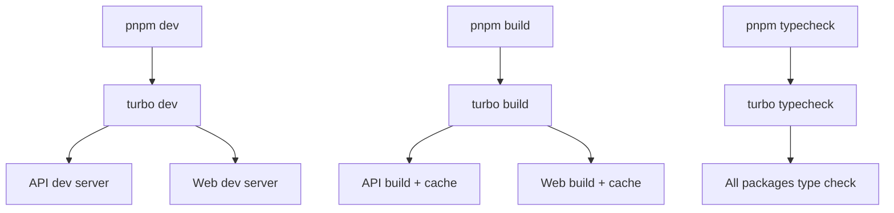

# 🏗️ アーキテクチャ設計

## 🎯 設計思想

### Turbo統一アプローチ
- **統一されたタスク実行**: Turboによる一元管理
- **キャッシュ最適化**: ビルド・型チェック・テスト等の高速化
- **stream UI**: 永続タスク（dev servers）に最適化

## 📊 タスク管理戦略

### Turborepoの役割分担

### UI戦略

- **開発時**: `"ui": "stream"` - 永続プロセスの出力を適切に表示
- **ビルド時**: Turboの並列実行とキャッシュ機能をフル活用
- **型チェック**: 依存関係を考慮した最適な実行順序

## 🔧 技術選択の理由

### Turbo vs concurrently

| 観点 | Turbo | concurrently |
|------|--------|--------------|
| キャッシュ | ✅ 強力 | ❌ なし |
| 依存関係管理 | ✅ 自動 | ❌ 手動 |
| 並列実行 | ✅ 最適化済み | ✅ 基本的 |
| 永続タスク | ✅ stream UI | ✅ 色分け表示 |
| 統一性 | ✅ 一つのツール | ❌ 複数ツール |

### 最終決定: **Turbo統一**

- モノレポ管理の一元化
- 開発体験の統一
- パフォーマンス最適化
- メンテナンス性向上