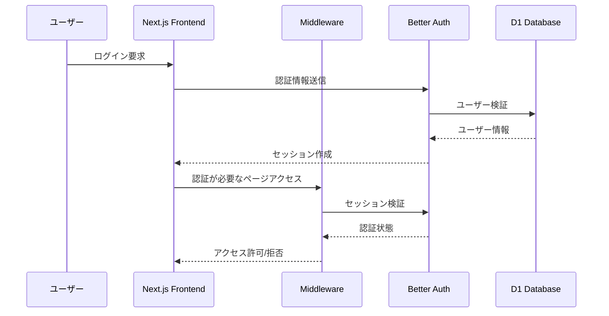
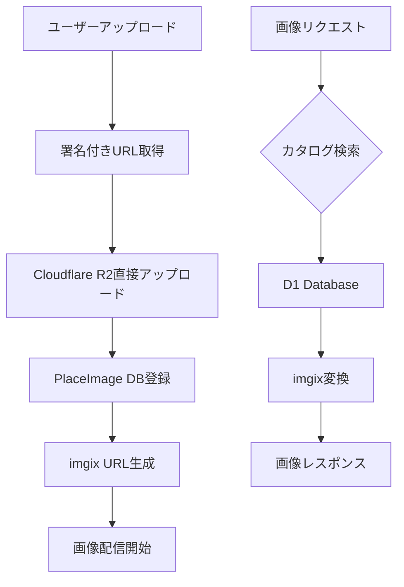

# PlaceAstro アーキテクチャ設計（逆生成）

## 分析日時
2025-08-24

## システム概要

### 実装されたアーキテクチャ
- **パターン**: Edgeファースト・サーバーレスアーキテクチャ
- **フレームワーク**: Next.js 15 (App Router) + Hono
- **構成**: フルスタック・モノレポ構成
- **デプロイ先**: Cloudflare Workers + Pages

### 技術スタック

#### フロントエンド
- **フレームワーク**: Next.js 15.2.4 (React 19.0.0)
- **状態管理**: Tanstack Query (サーバー状態管理)
- **UI ライブラリ**: Radix UI + shadcn/ui
- **スタイリング**: TailwindCSS v4 + CSS Modules
- **フォーム管理**: React Hook Form + Zod
- **ファイルアップロード**: Uppy.js
- **アニメーション**: Embla Carousel + Lucide Icons

#### バックエンド
- **フレームワーク**: Hono (Cloudflare Workers向け)
- **型安全ルーティング**: jstack (Honoベース)
- **認証方式**: Better Auth (セッションベース認証)
- **ORM/データアクセス**: Drizzle ORM
- **バリデーション**: Zod
- **シリアライゼーション**: SuperJSON
- **エラーハンドリング**: neverthrow (Result型)

#### データベース
- **DBMS**: Cloudflare D1 (SQLite)
- **キャッシュ**: Cloudflare Workers KV (未実装)
- **接続プール**: Drizzle ORM内蔵プール

#### ストレージ・CDN
- **オブジェクトストレージ**: Cloudflare R2 (S3互換)
- **画像CDN**: imgix
- **画像最適化**: リアルタイム変換 (w, h パラメータ対応)

#### インフラ・ツール
- **ビルドツール**: Next.js内蔵 + Wrangler
- **テストフレームワーク**: 未実装
- **コード品質**: Biome (ESLint + Prettier代替)
- **パッケージマネージャー**: pnpm
- **デプロイ**: Wrangler CLI

## レイヤー構成

### 発見されたレイヤー
```
src/
├── app/                    # プレゼンテーション層 (Next.js App Router)
│   ├── components/        # 画面固有コンポーネント
│   ├── [catalogue]/       # 動的ルーティング
│   ├── login/            # 認証画面
│   ├── upload/           # アップロード画面
│   └── api/[[...route]]/ # API ルートハンドラー
├── components/            # 共通UIコンポーネント
├── lib/                  # クライアントサイドユーティリティ
├── auth/                 # 認証コンポーネント
├── server/               # アプリケーション・インフラ層
│   ├── routers/         # APIルーター (アプリケーション層)
│   ├── schema/          # バリデーションスキーマ
│   ├── db/              # データベーススキーマ (インフラ層)
│   └── lib/             # サーバーユーティリティ
└── types/               # 型定義
```

### レイヤー責務分析
- **プレゼンテーション層**: Next.jsコンポーネント、ページルーティング、UIロジック
- **アプリケーション層**: jstackルーター、ビジネスロジック、認証・認可
- **ドメイン層**: 部分的実装 (placeImageエンティティ、バリデーションスキーマ)
- **インフラストラクチャ層**: Drizzle ORM、Cloudflare Workers、R2、D1

## デザインパターン

### 発見されたパターン
- **Dependency Injection**: jstackのコンテキスト注入
- **Repository Pattern**: 部分的実装 (Drizzle ORMクエリビルダー)
- **Factory Pattern**: S3Clientファクトリー (`getS3Client`)
- **Observer Pattern**: Tanstack Queryによるリアクティブ状態管理
- **Strategy Pattern**: 認証方式切り替え (Better Auth)

### アーキテクチャの特徴
- **Type-safe Full Stack**: jstackによるエンドツーエンド型安全性
- **Edge-first**: Cloudflareエッジで動作する最適化
- **Zero-latency**: D1 + R2 + imgixによる高速画像配信
- **Serverless**: 完全サーバーレス構成

## 非機能要件の実装状況

### セキュリティ
- **認証**: Better Auth (メール＋パスワード認証)
- **認可**: privateProcedureによるルート保護
- **CORS設定**: Honoミドルウェアで設定
- **HTTPS対応**: Cloudflare自動SSL

### パフォーマンス
- **キャッシュ**: ブラウザキャッシュ + Cloudflareエッジキャッシュ
- **データベース最適化**: インデックス設定 (`catalogue_idx`, `catalogue_number_idx`)
- **CDN**: imgix画像CDN + Cloudflare
- **画像最適化**: リアルタイムリサイズ・フォーマット変換

### 運用・監視
- **ログ出力**: 基本的なconsole.log (構造化ログ未実装)
- **エラートラッキング**: 未実装
- **メトリクス収集**: 未実装
- **ヘルスチェック**: `/api/placeImages/health` エンドポイント

## セキュリティアーキテクチャ

### 認証フロー


### 認可システム
- **publicProcedure**: 認証不要エンドポイント
- **privateProcedure**: セッション認証必須エンドポイント
- **ミドルウェア保護**: `/upload`, `/sign-up` などの保護ルート

## データアーキテクチャ

### データフロー概要


### ストレージ戦略
- **R2**: 元画像ファイル保存
- **imgix**: 画像変換・最適化・CDN
- **D1**: メタデータ (URL、クレジット、カタログ情報)

## スケーラビリティ設計

### 水平スケーリング
- **Cloudflare Workers**: 自動スケーリング
- **D1 Database**: 読み取りレプリケーション対応
- **R2 Storage**: 無制限スケーリング

### パフォーマンス最適化
- **エッジコンピューティング**: 全世界200+のエッジロケーション
- **画像配信**: imgixによるリアルタイム最適化
- **データベース**: インデックスによる高速検索

## 技術的制約・トレードオフ

### 制約事項
- **Cloudflare Workers制限**: CPU時間、メモリ制限
- **D1制限**: 同期書き込み、複雑クエリの制限
- **コールドスタート**: 初回リクエストのレイテンシ

### 設計判断
- **SQLiteベース**: 軽量、高速、エッジ配置可能
- **jstack採用**: 型安全性 vs 学習コスト
- **Better Auth**: 軽量 vs 機能の制限

## 改善推奨点

### アーキテクチャ改善
- **キャッシュ層**: Workers KVによるメタデータキャッシュ
- **イベント駆動**: R2 Webhookによる画像処理自動化
- **モニタリング**: Cloudflare Analytics + 外部APM

### セキュリティ強化
- **レート制限**: API呼び出し制限
- **入力サニタイゼーション**: XSS対策強化
- **APIキー認証**: 外部API用認証方式

### 運用改善
- **CI/CD**: GitHub Actions + Wrangler
- **環境分離**: dev/staging/prod環境
- **バックアップ**: D1データベースバックアップ戦略