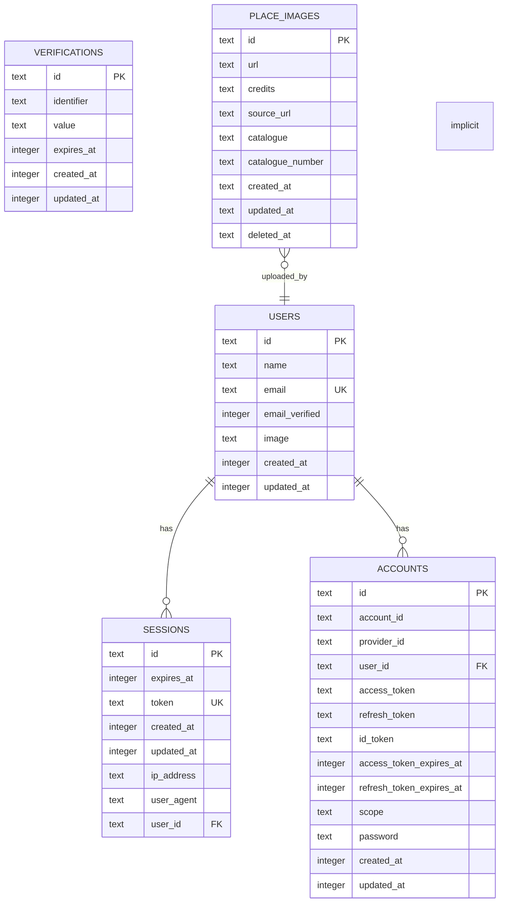

# PlaceAstro データベース設計（逆生成）

## スキーマ概要

### データベース情報
- **DBMS**: Cloudflare D1 (SQLite)
- **ORM**: Drizzle ORM
- **マイグレーション**: Drizzle Kit
- **文字エンコーディング**: UTF-8

### テーブル一覧
1. **place_images** - 天体画像情報
2. **users** - ユーザー情報
3. **sessions** - セッション管理
4. **accounts** - 認証アカウント管理
5. **verifications** - メール認証管理

## ER図


## テーブル詳細

### place_images テーブル
```sql
CREATE TABLE `place_images` (
    `id` text PRIMARY KEY NOT NULL,
    `url` text NOT NULL,
    `credits` text NOT NULL,
    `source_url` text NOT NULL,
    `catalogue` text NOT NULL,
    `catalogue_number` text NOT NULL,
    `created_at` text DEFAULT (current_timestamp) NOT NULL,
    `updated_at` text DEFAULT (current_timestamp) NOT NULL,
    `deleted_at` text
);
```

**カラム説明**:
- `id`: 主キー (UUID)
- `url`: imgix画像配信URL
- `credits`: 画像クレジット情報
- `source_url`: 元画像のソースURL
- `catalogue`: 天体カタログ ('M' または 'NGC')
- `catalogue_number`: カタログ番号
- `created_at`: 作成日時 (ISO 8601文字列)
- `updated_at`: 更新日時 (ISO 8601文字列)
- `deleted_at`: 論理削除日時 (ソフトデリート)

**インデックス**:
- `catalogue_idx`: catalogue カラムの検索用
- `catalogue_number_idx`: catalogue_number カラムの検索用

**制約**:
- `catalogue`: 'M' または 'NGC' のみ許可 (アプリケーションレベル)
- `url`: 必須フィールド
- `credits`: 必須フィールド
- `source_url`: 必須フィールド

### users テーブル
```sql
CREATE TABLE `users` (
    `id` text PRIMARY KEY NOT NULL,
    `name` text NOT NULL,
    `email` text NOT NULL,
    `email_verified` integer NOT NULL,
    `image` text,
    `created_at` integer NOT NULL,
    `updated_at` integer NOT NULL
);
CREATE UNIQUE INDEX `users_email_unique` ON `users` (`email`);
```

**カラム説明**:
- `id`: ユーザーID (主キー)
- `name`: ユーザー名
- `email`: メールアドレス (一意制約)
- `email_verified`: メール認証フラグ (0/1)
- `image`: プロフィール画像URL (オプション)
- `created_at`: 作成日時 (Unix timestamp)
- `updated_at`: 更新日時 (Unix timestamp)

**インデックス**:
- `users_email_unique`: email カラムの一意制約

### sessions テーブル
```sql
CREATE TABLE `sessions` (
    `id` text PRIMARY KEY NOT NULL,
    `expires_at` integer NOT NULL,
    `token` text NOT NULL,
    `created_at` integer NOT NULL,
    `updated_at` integer NOT NULL,
    `ip_address` text,
    `user_agent` text,
    `user_id` text NOT NULL,
    FOREIGN KEY (`user_id`) REFERENCES `users`(`id`) ON DELETE cascade
);
CREATE UNIQUE INDEX `sessions_token_unique` ON `sessions` (`token`);
```

**カラム説明**:
- `id`: セッションID (主キー)
- `expires_at`: セッション有効期限 (Unix timestamp)
- `token`: セッショントークン (一意)
- `created_at`: 作成日時 (Unix timestamp)
- `updated_at`: 更新日時 (Unix timestamp)
- `ip_address`: IPアドレス (オプション)
- `user_agent`: ユーザーエージェント (オプション)
- `user_id`: ユーザーID (外部キー)

**インデックス**:
- `sessions_token_unique`: token カラムの一意制約

**外部キー制約**:
- `user_id → users.id` (CASCADE DELETE)

### accounts テーブル
```sql
CREATE TABLE `accounts` (
    `id` text PRIMARY KEY NOT NULL,
    `account_id` text NOT NULL,
    `provider_id` text NOT NULL,
    `user_id` text NOT NULL,
    `access_token` text,
    `refresh_token` text,
    `id_token` text,
    `access_token_expires_at` integer,
    `refresh_token_expires_at` integer,
    `scope` text,
    `password` text,
    `created_at` integer NOT NULL,
    `updated_at` integer NOT NULL,
    FOREIGN KEY (`user_id`) REFERENCES `users`(`id`) ON DELETE cascade
);
```

**カラム説明**:
- `id`: アカウントID (主キー)
- `account_id`: 外部プロバイダーのアカウントID
- `provider_id`: 認証プロバイダーID
- `user_id`: ユーザーID (外部キー)
- `access_token`: アクセストークン
- `refresh_token`: リフレッシュトークン
- `id_token`: IDトークン
- `access_token_expires_at`: アクセストークン有効期限
- `refresh_token_expires_at`: リフレッシュトークン有効期限
- `scope`: 認証スコープ
- `password`: ハッシュ化されたパスワード
- `created_at`: 作成日時 (Unix timestamp)
- `updated_at`: 更新日時 (Unix timestamp)

**外部キー制約**:
- `user_id → users.id` (CASCADE DELETE)

### verifications テーブル
```sql
CREATE TABLE `verifications` (
    `id` text PRIMARY KEY NOT NULL,
    `identifier` text NOT NULL,
    `value` text NOT NULL,
    `expires_at` integer NOT NULL,
    `created_at` integer,
    `updated_at` integer
);
```

**カラム説明**:
- `id`: 認証ID (主キー)
- `identifier`: 認証識別子 (メールアドレス等)
- `value`: 認証トークン/コード
- `expires_at`: 有効期限 (Unix timestamp)
- `created_at`: 作成日時 (Unix timestamp)
- `updated_at`: 更新日時 (Unix timestamp)

## 制約・関係性

### 外部キー制約
- `sessions.user_id → users.id` (CASCADE DELETE)
- `accounts.user_id → users.id` (CASCADE DELETE)

### ユニーク制約
- `users.email`: メールアドレスの一意性
- `sessions.token`: セッショントークンの一意性

### インデックス戦略
- **place_images**: カタログ検索の高速化
  - `catalogue_idx`: カタログ別検索
  - `catalogue_number_idx`: カタログ番号検索
- **users**: メール検索の高速化
  - `users_email_unique`: ログイン時の高速検索
- **sessions**: トークン検索の高速化
  - `sessions_token_unique`: セッション検証の高速化

## データアクセスパターン

### よく使用されるクエリ

#### 画像関連
```sql
-- カタログ別画像一覧 (最新順)
SELECT * FROM place_images 
WHERE catalogue = 'M' 
ORDER BY created_at DESC;

-- 特定カタログ番号の画像取得
SELECT * FROM place_images 
WHERE catalogue = 'M' AND catalogue_number = '42';

-- ランダム画像取得
SELECT * FROM place_images 
ORDER BY RANDOM() 
LIMIT 1;
```

#### 認証関連
```sql
-- メールアドレスでユーザー検索
SELECT * FROM users 
WHERE email = ?;

-- セッション検証
SELECT u.*, s.* FROM sessions s
JOIN users u ON s.user_id = u.id
WHERE s.token = ? AND s.expires_at > ?;
```

### パフォーマンス考慮事項

#### インデックス活用
- **catalogue + catalogue_number**: 複合インデックス検討余地
- **created_at**: 日時ソートの高速化（未実装）
- **user_id in place_images**: ユーザー別画像検索（将来対応）

#### クエリ最適化
- **LIMIT使用**: 一覧取得時のページネーション
- **複合条件**: WHERE句での効率的な絞り込み
- **JOIN最小化**: 必要な場合のみ結合処理

## データ型の特徴

### SQLiteの制限・特徴
- **TEXT型**: 可変長文字列（ID、URL、トークン等）
- **INTEGER型**: Unix timestampによる日時管理
- **日時文字列**: place_imagesでISO 8601形式を使用
- **Boolean**: integer (0/1) で表現

### 型の使い分け
- **認証系**: Unix timestamp (integer)
- **ビジネスデータ**: ISO 8601文字列 (text)
- **ID**: UUID文字列 (text)

## セキュリティ考慮事項

### データ保護
- **パスワードハッシュ化**: Better Authによる自動ハッシュ化
- **セッション管理**: 有効期限付きトークン
- **個人情報**: 最小限の保存（名前、メール）

### アクセス制御
- **CASCADE DELETE**: 関連データの自動削除
- **ソフトデリート**: place_imagesで論理削除対応
- **セッション無効化**: 期限切れセッションの自動削除

## 将来の拡張可能性

### スケーラビリティ
- **読み取りレプリカ**: D1の読み取り専用レプリカ活用
- **パーティショニング**: カタログ別のテーブル分割検討
- **キャッシュ戦略**: Workers KVによるメタデータキャッシュ

### 機能拡張
- **タグ機能**: 画像へのタグ付け
- **コレクション**: ユーザー別画像コレクション
- **評価システム**: 画像への評価・コメント機能
- **統計情報**: 画像ビュー数、ダウンロード数