# PlaceAstro データフロー図（逆生成）

## ユーザーインタラクションフロー

### 画像アップロードフロー
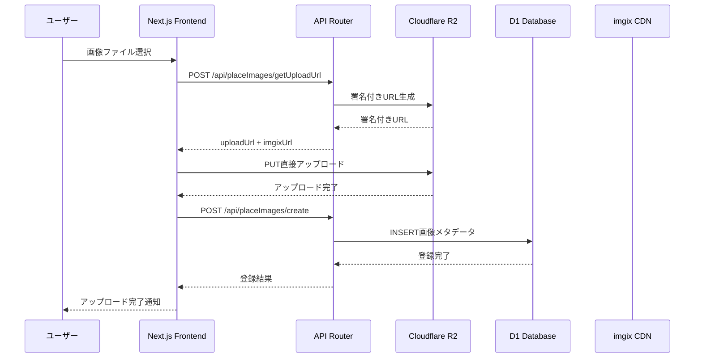

### 画像取得・表示フロー
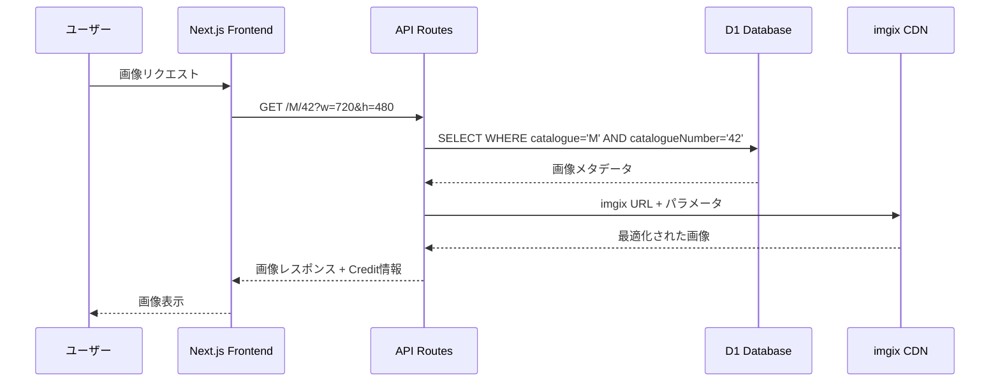

### 認証フロー
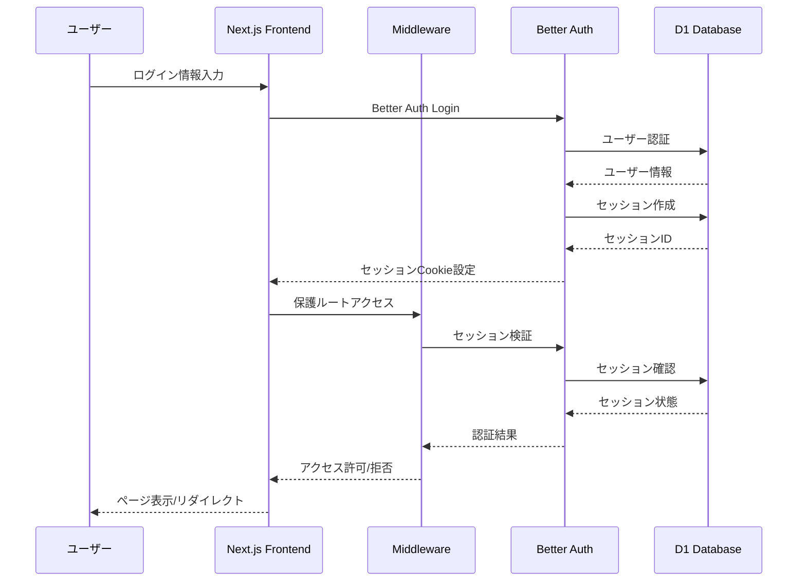

## データ取得フロー

### フロントエンド → API → データベース
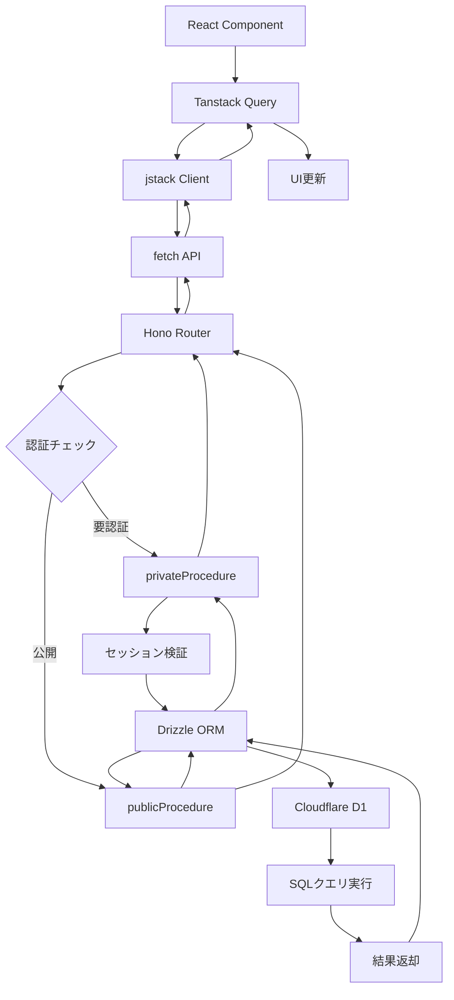

## 状態管理フロー

### Tanstack Query によるサーバー状態管理
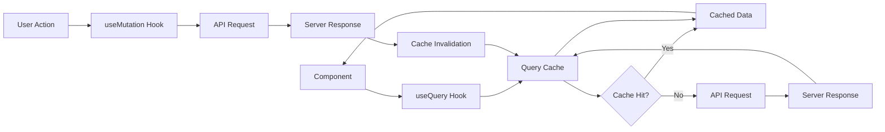

### クライアント状態管理（認証）
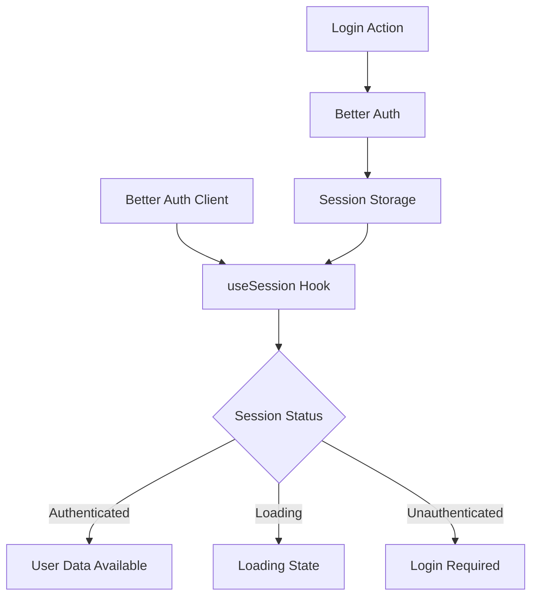

## エラーハンドリングフロー

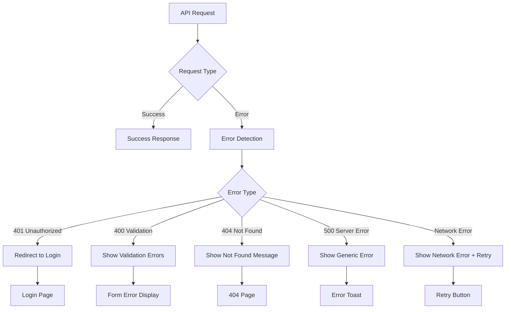

## 画像処理パイプライン

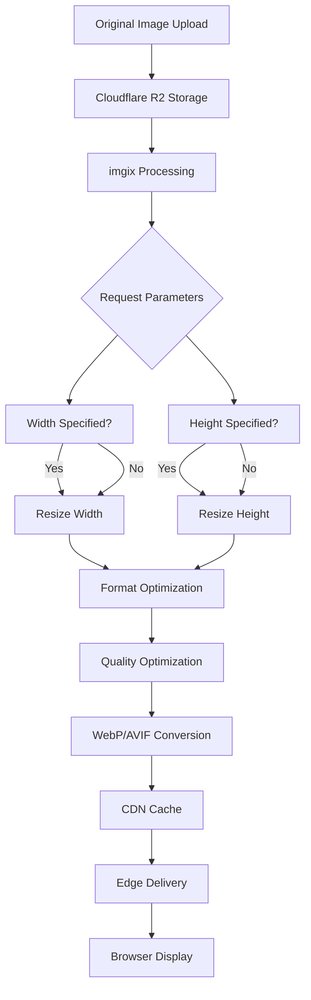

## ランダム画像取得フロー

```mermaid
flowchart TD
    A[GET /random] --> B[Drizzle Query]
    B --> C[ORDER BY RANDOM()]
    C --> D[LIMIT 1]
    D --> E[Image Metadata]
    E --> F[imgix URL Construction]
    F --> G[Query Parameters]
    G --> H{Parameters Present?}
    H -->|Yes| I[Add w/h parameters]
    H -->|No| J[Original Image]
    I --> K[Redirect Response]
    J --> K
    K --> L[imgix Processing]
    L --> M[Image Delivery]
```

## カタログ検索フロー

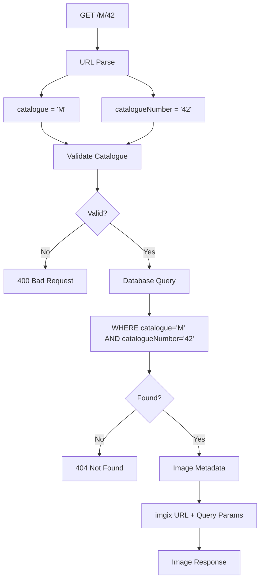

## リアルタイムデータ同期

### アップロード後の一覧更新
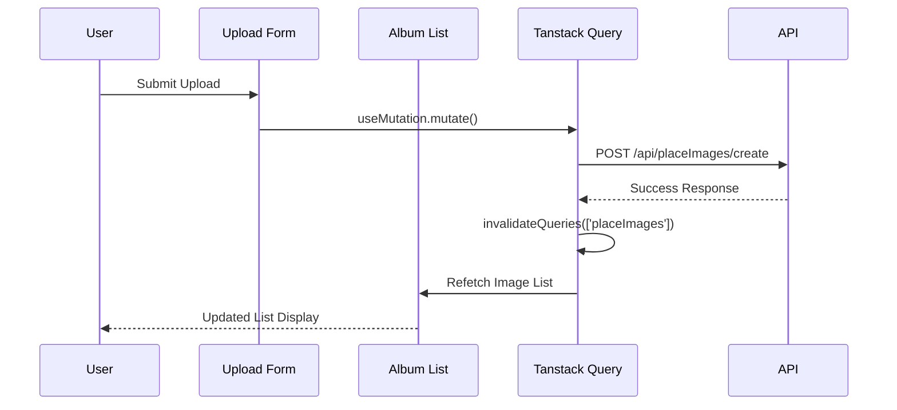

## パフォーマンス最適化フロー

### 画像の段階的読み込み
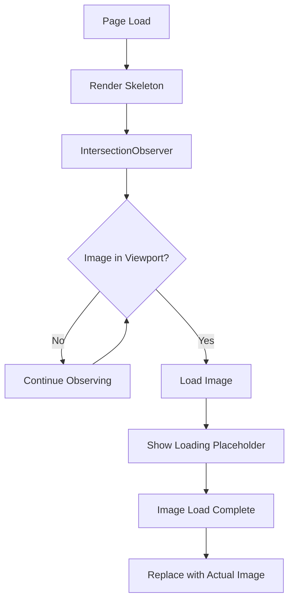

### キャッシュ戦略
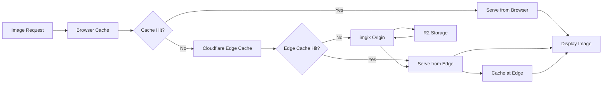