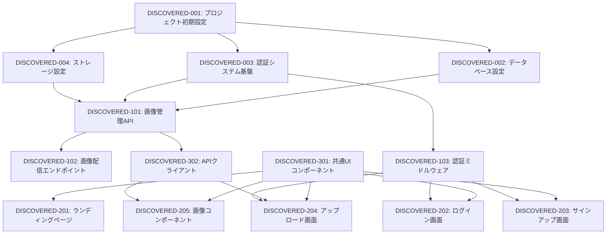

# PlaceAstro 発見タスク一覧

## 概要

**分析日時**: 2025-08-24
**対象コードベース**: /Users/john/dev/placeastro-with-jstack
**発見タスク数**: 25
**推定総工数**: 180時間

## コードベース構造

### プロジェクト情報
- **フレームワーク**: Next.js 15.2.4 + Hono
- **言語**: TypeScript
- **データベース**: Cloudflare D1 (SQLite)
- **主要ライブラリ**: React 19, Drizzle ORM, Better Auth, Tanstack Query, Zod

### ディレクトリ構造
```
src/
├── app/                    # Next.jsアプリケーション
│   ├── [catalogue]/       # 動的ルート（画像取得）
│   ├── api/[[...route]]/  # APIルートハンドラー
│   ├── components/        # アプリ固有コンポーネント
│   ├── login/            # ログインページ
│   ├── sign-up/          # サインアップページ
│   ├── upload/           # アップロードページ
│   └── random/           # ランダム画像取得
├── auth/                  # 認証関連コンポーネント
├── components/           # 共通UIコンポーネント
├── lib/                  # ユーティリティ関数
├── server/              # バックエンドAPI
│   ├── db/             # データベーススキーマ
│   ├── lib/            # サーバーユーティリティ
│   ├── routers/        # APIルーター
│   └── schema/         # バリデーションスキーマ
└── types/              # TypeScript型定義
```

## 発見されたタスク

### 基盤・設定タスク

#### DISCOVERED-001: プロジェクト初期設定

- [x] **タスク完了** (実装済み)
- **タスクタイプ**: DIRECT
- **実装ファイル**: 
  - `package.json`
  - `tsconfig.json`
  - `next.config.mjs`
  - `wrangler.jsonc`
- **実装詳細**:
  - Next.js 15とReact 19の最新版を使用
  - Cloudflare Workers向けのビルド設定
  - TypeScript 5の厳格な型チェック設定
  - Biomeによるコード品質管理
- **推定工数**: 8時間

#### DISCOVERED-002: データベース設定

- [x] **タスク完了** (実装済み)
- **タスクタイプ**: DIRECT
- **実装ファイル**: 
  - `drizzle.config.ts`
  - `src/server/lib/db.ts`
  - `drizzle/0000_init.sql`
  - `drizzle/0001_auth.sql`
- **実装詳細**:
  - Cloudflare D1データベースの設定
  - Drizzle ORMの統合
  - マイグレーションファイルの作成
  - データベーススタジオの設定
- **推定工数**: 6時間

#### DISCOVERED-003: 認証システム基盤

- [x] **タスク完了** (実装済み)
- **タスクタイプ**: DIRECT
- **実装ファイル**: 
  - `src/server/lib/auth.ts`
  - `src/lib/auth-client.ts`
  - `src/lib/auth-client-server.ts`
  - `src/server/db/auth-schema.ts`
- **実装詳細**:
  - Better Authライブラリの統合
  - メール＋パスワード認証の実装
  - セッション管理機能
  - 認証テーブルの設計
- **推定工数**: 12時間

#### DISCOVERED-004: ストレージ設定 (R2)

- [x] **タスク完了** (実装済み)
- **タスクタイプ**: DIRECT
- **実装ファイル**: 
  - `src/server/lib/s3.ts`
  - 環境変数設定
- **実装詳細**:
  - Cloudflare R2の設定
  - S3互換クライアントの設定
  - 署名付きURLの生成機能
- **推定工数**: 4時間

### API実装タスク

#### DISCOVERED-101: 画像管理API

- [x] **タスク完了** (実装済み)
- **タスクタイプ**: TDD
- **実装ファイル**: 
  - `src/server/routers/place-image-router.ts`
  - `src/server/schema/place-image-schema.ts`
  - `src/server/jstack.ts`
- **実装詳細**:
  - 画像一覧取得API
  - 画像詳細取得API
  - 画像登録API（認証必須）
  - アップロードURL生成API（認証必須）
- **APIエンドポイント**:
  - `GET /api/placeImages/health`
  - `GET /api/placeImages/list`
  - `GET /api/placeImages/getByKey`
  - `POST /api/placeImages/create`
  - `POST /api/placeImages/getUploadUrl`
- **テスト実装状況**:
  - [ ] 単体テスト: 未実装
  - [ ] 統合テスト: 未実装
  - [ ] E2Eテスト: 未実装
- **推定工数**: 16時間

#### DISCOVERED-102: 画像配信エンドポイント

- [x] **タスク完了** (実装済み)
- **タスクタイプ**: TDD
- **実装ファイル**: 
  - `src/app/[catalogue]/[catalogueNumber]/route.ts`
  - `src/app/[catalogue]/[catalogueNumber]/info/route.ts`
  - `src/app/random/route.ts`
- **実装詳細**:
  - カタログ番号による画像取得
  - imgixを使用した画像変換
  - ランダム画像取得機能
  - 画像情報取得API
- **推定工数**: 8時間

#### DISCOVERED-103: 認証ミドルウェア

- [x] **タスク完了** (実装済み)
- **タスクタイプ**: TDD
- **実装ファイル**: 
  - `src/middleware.ts`
  - `src/server/jstack.ts`
- **実装詳細**:
  - publicProcedureとprivateProcedureの定義
  - セッション検証機能
  - ルート保護の実装
- **推定工数**: 6時間

### UI実装タスク

#### DISCOVERED-201: ランディングページ

- [x] **タスク完了** (実装済み)
- **タスクタイプ**: TDD
- **実装ファイル**: 
  - `src/app/page.tsx`
  - `src/app/components/gallery.tsx`
  - `src/app/globals.css`
- **実装詳細**:
  - コードサンプル表示
  - コピー機能付きスニペット
  - ギャラリーコンポーネント
  - ダークテーマデザイン
- **UI/UX実装状況**:
  - [x] レスポンシブデザイン
  - [x] アニメーション
  - [x] コピー機能
  - [ ] アクセシビリティ: 部分的実装
- **テスト実装状況**:
  - [ ] コンポーネントテスト: 未実装
  - [ ] E2Eテスト: 未実装
- **推定工数**: 8時間

#### DISCOVERED-202: ログイン画面

- [x] **タスク完了** (実装済み)
- **タスクタイプ**: TDD
- **実装ファイル**: 
  - `src/app/login/page.tsx`
  - Better Auth組み込みUI使用
- **実装詳細**:
  - Better Authのログインコンポーネント
  - リダイレクト機能
- **推定工数**: 4時間

#### DISCOVERED-203: サインアップ画面

- [x] **タスク完了** (実装済み)
- **タスクタイプ**: TDD
- **実装ファイル**: 
  - `src/app/sign-up/page.tsx`
  - `src/auth/sign-up.tsx`
- **実装詳細**:
  - Better Authのサインアップコンポーネント
  - 環境変数による制御機能
- **推定工数**: 4時間

#### DISCOVERED-204: アップロード画面

- [x] **タスク完了** (実装済み)
- **タスクタイプ**: TDD
- **実装ファイル**: 
  - `src/app/upload/page.tsx`
  - `src/app/components/place-image-upload-form.tsx`
  - `src/app/components/place-image-list.tsx`
- **実装詳細**:
  - Uppyを使用したアップロードUI
  - ドラッグ＆ドロップ対応
  - 画像一覧表示
  - フォームバリデーション
- **推定工数**: 12時間

#### DISCOVERED-205: 画像コンポーネント

- [x] **タスク完了** (実装済み)
- **タスクタイプ**: TDD
- **実装ファイル**: 
  - `src/app/components/place-image.tsx`
  - `src/app/components/copy-to-clipboard.tsx`
- **実装詳細**:
  - 画像カード表示
  - クレジット情報表示
  - URLコピー機能
  - レスポンシブデザイン
- **推定工数**: 6時間

### ユーティリティ実装タスク

#### DISCOVERED-301: 共通UIコンポーネント

- [x] **タスク完了** (実装済み)
- **タスクタイプ**: DIRECT
- **実装ファイル**: 
  - `src/components/ui/*.tsx`
  - `src/components/theme-provider.tsx`
- **実装詳細**:
  - Radix UIベースのコンポーネント
  - ボタン、ツールチップ、カルーセル
  - ダークモード対応
- **推定工数**: 8時間

#### DISCOVERED-302: API クライアント

- [x] **タスク完了** (実装済み)
- **タスクタイプ**: DIRECT
- **実装ファイル**: 
  - `src/lib/client.ts`
  - `src/lib/query-key.ts`
  - `src/app/components/providers.tsx`
- **実装詳細**:
  - jstackクライアントの設定
  - Tanstack Queryの統合
  - 型安全なAPI呼び出し
- **推定工数**: 6時間

## 未実装・改善推奨事項

### 不足しているテスト

- [ ] **E2Eテストスイート**: Playwright/Cypressによる主要フローのテスト
- [ ] **APIテスト**: Vitestによる統合テスト
- [ ] **コンポーネントテスト**: React Testing Libraryによるテスト
- [ ] **パフォーマンステスト**: 画像配信のレスポンス時間測定

### コード品質改善

- [ ] **エラーハンドリング**: 統一的なエラー処理パターン
- [ ] **ログ出力**: 構造化ログの実装
- [ ] **型安全性**: any型の排除
- [ ] **認証エラー**: より詳細なエラーメッセージ

### ドキュメント不足

- [ ] **API仕様書**: OpenAPI/Swagger形式
- [ ] **開発者ガイド**: セットアップとデプロイ手順
- [ ] **アーキテクチャ図**: システム構成の可視化
- [ ] **コントリビューションガイド**: 開発参加手順

### セキュリティ強化

- [ ] **レート制限**: API呼び出しの制限
- [ ] **入力検証**: より厳格なバリデーション
- [ ] **CORS設定**: 環境別の適切な設定
- [ ] **監査ログ**: 重要操作の記録

## 依存関係マップ



## 実装パターン分析

### アーキテクチャパターン
- **実装パターン**: Edgeファースト・サーバーレスアーキテクチャ
- **状態管理**: Tanstack Queryによるサーバー状態管理
- **認証方式**: Better Authによるセッションベース認証

### コーディングスタイル
- **命名規則**: camelCase（関数）、PascalCase（コンポーネント）
- **ファイル構成**: 機能別ディレクトリ構造
- **エラーハンドリング**: HTTPExceptionによる統一処理

## 技術的負債・改善点

### パフォーマンス
- 画像の遅延読み込み未実装
- キャッシュ戦略の最適化が必要
- バンドルサイズの最適化余地あり

### セキュリティ
- APIキー認証の未実装（現在のブランチで対応中）
- アップロードファイルサイズ制限の明示的な実装が必要
- CSRFトークンの実装検討

### 保守性
- テストカバレッジ0%（テスト未実装）
- エラー監視・APMツールの未導入
- CI/CDパイプラインの未構築

## 推奨次ステップ

1. **テスト基盤の構築** - Vitest/Playwrightの導入と基本テストの作成
2. **APIキー認証の実装** - 現在のブランチ作業の完了
3. **ドキュメント整備** - API仕様書と開発ガイドの作成
4. **監視・ログ基盤** - Sentryなどのエラー監視ツール導入
5. **CI/CDパイプライン** - GitHub ActionsによるデプロイAutomation